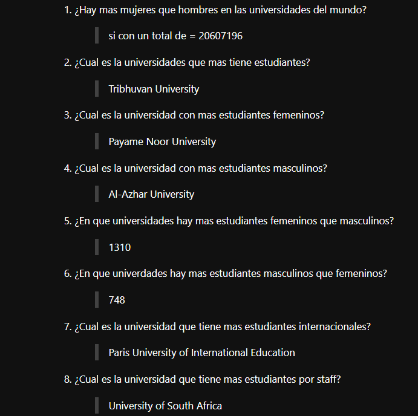
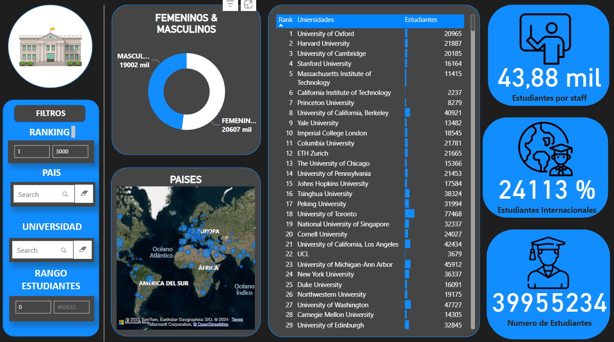

# Ranking_universidades_del_mundo

## No hay desigualdad de genero en las universidades

  Cuando empece a practicar la limpieza de datos en Python, quise elegir un
tema que tratase con estudiantes; dentro de kaggle.com, ubiqué una data que se
llamaba Ranking de las universidades del mundo, una data muy específica de las
universidades de todos los países del mundo con diferentes características,
como número de estudiantes entre hombres y mujeres, cuantos estudiantes había
por staff.

  En principio solo use código en pandas para limpiar los datos, pero no
tenían intención de los resultados que arrojaban, pero todo eso cambió cuando
comencé a generar insights de esos datos y aún más cuando los exporte a Power
Bi.

  La información tan relevante que me estaba perdiendo por no analizar los
datos que había limpiado.

Me hice las siguientes preguntas que pueden visualizar en la imagen, datos que revelan que son más las cantidades de mujeres que de hombres realizando estudios universitarios.

  Al utilizar Power BI, pude mostrar detalladamente los datos importantes que generó la información de las universidades en el mundo. como los países en un mapa de geolocalización. tablas de ranking con KPIs.

  Cuando uno empieza en el mundo Tech, lo primero que uno piensa es en ser experto en las herramientas y habilidades técnicas. Pero lo único que importa es; resolver problemas. Como analista de datos, con la big data que puedo analizar, tengo que obtener información importante para poder resolver problemas.

